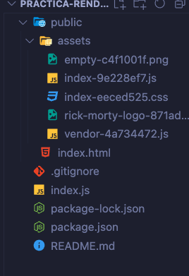
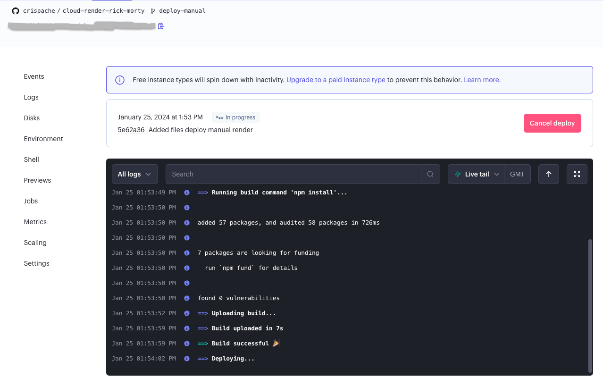
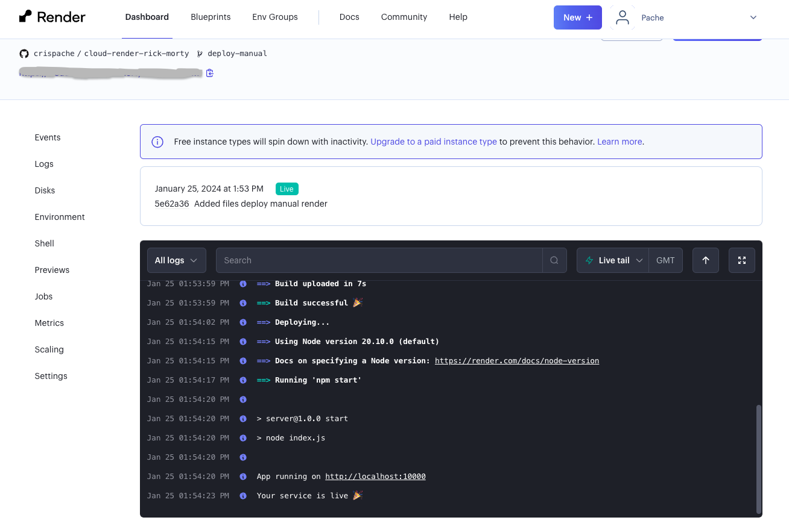

# Rick & Morty (Deploy manually on Render)
Es un proyecto en el que se muestra un listado de los personajes de la serie Rick & Morty. En la interfaz, los usuarios pueden buscar personajes y acceder a los detalles de cada uno.

La API que se usa en el proyecto:
https://rickandmortyapi.com/


#### Tecnologías

- React
- Material UI
- TypeScript
- Vite
- Axios


#### Proceso

1. Contruir build de la app




2. Crear Web Service en Render


3.Proceso de creación del Web Service


4.Desplegando




5.Despliegue con éxito




## Setup

Make sure to install the dependencies:

```bash
# npm
npm install

# pnpm
pnpm install

# yarn
yarn install
```

## Development Server

Start the development server on `http://localhost:8080`:

```bash
# npm
npm run start

# pnpm
pnpm run start

# yarn
yarn start
```

## Production

Build the application for production:

```bash
# npm
npm run build

# pnpm
pnpm run build

# yarn
yarn build
```
